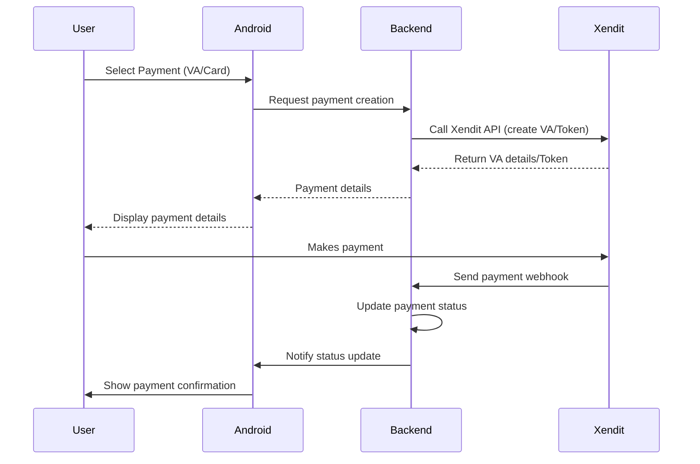

### **1. Preparation**
- **Register a Xendit Account**  
  Create an account on the [Xendit Dashboard](https://dashboard.xendit.co/) and obtain your **API Key** (use *Sandbox* mode for testing).  
- **Add Dependency**  
  In `build.gradle` (Module:app):
  ```gradle
  implementation 'com.xendit:xendit-android:{latest_version}'
  ```

---

### **2. Payment Integration Flow (Example: Virtual Account)**
#### **Step 1: Initialize Xendit in the App**  
```java
public class MainActivity extends AppCompatActivity {
    private Xendit xendit;

    @Override
    protected void onCreate(Bundle savedInstanceState) {
        super.onCreate(savedInstanceState);
        xendit = new Xendit(this, "xnd_public_key_YourKey");
    }
}
```

#### **Step 2: Create a Virtual Account (VA) via Backend**  
**⚠️ Never do this in Android!** Use your backend to call Xendit's API (keep API keys secure):  
```java
// Example Retrofit request to your backend
public interface XenditService {
    @POST("/create-va")
    Call<VaResponse> createVA(@Body VaRequest request);
}

// Call from Android
XenditService service = RetrofitClient.getRetrofitInstance().create(XenditService.class);
Call<VaResponse> call = service.createVA(new VaRequest("bni", 100000, "123"));
call.enqueue(new Callback<VaResponse>() {
    @Override
    public void onResponse(Call<VaResponse> call, Response<VaResponse> response) {
        if (response.isSuccessful()) {
            String vaNumber = response.body().getVaNumber(); // Show to user
        }
    }
    @Override
    public void onFailure(Call<VaResponse> call, Throwable t) {
        Log.e("Error", t.getMessage());
    }
});
```

#### **Step 3: Handle Payment Callback**  
- **Method 1: Webhook** (Recommended)  
  - Set up a webhook in the Xendit dashboard → point it to your backend endpoint.  
  - Backend sends notifications to Android via Firebase Cloud Messaging (FCM).  

- **Method 2: Polling** (Alternative)  
```java
// Periodically check payment status
public void checkPaymentStatus(String vaId) {
    XenditService service = RetrofitClient.getRetrofitInstance().create(XenditService.class);
    Call<PaymentStatus> call = service.getVAStatus(vaId);
    call.enqueue(new Callback<PaymentStatus>() {
        @Override
        public void onResponse(Call<PaymentStatus> call, Response<PaymentStatus> response) {
            if ("PAID".equals(response.body().getStatus())) {
                updateUI();
            }
        }
        @Override
        public void onFailure(Call<PaymentStatus> call, Throwable t) {
            Log.e("Error", t.getMessage());
        }
    });
}
```

---

### **3. Credit/Debit Card Flow**  
Use **Xendit Tokenization** (PCI DSS compliant):  
```java
// 1. Get card token
Card card = new Card("4811111111111114", "12", "2025", "123");
xendit.createSingleUseToken(card, "100000", new XenditCallback<Token>() {
    @Override
    public void onSuccess(Token token) {
        // Send token to backend for charging
        backend.chargeCard(token.getId());
    }
    @Override
    public void onError(XenditError error) {
        showError(error.getMessage());
    }
});
```

---

### **4. Best Practices**  
- **Never store API keys in Android** – Use a backend intermediary.  
- **Encrypt communication** – Ensure all requests use HTTPS.  
- **Verify webhook signatures** – Confirm data is from Xendit.  
- **Use Sandbox environment** during development.  

---

### **5. References**  
- [Official Xendit Android Docs](https://docs.xendit.co/mobile/xendit-android-sdk)  

---

### **Simplified Flow Diagram**  

