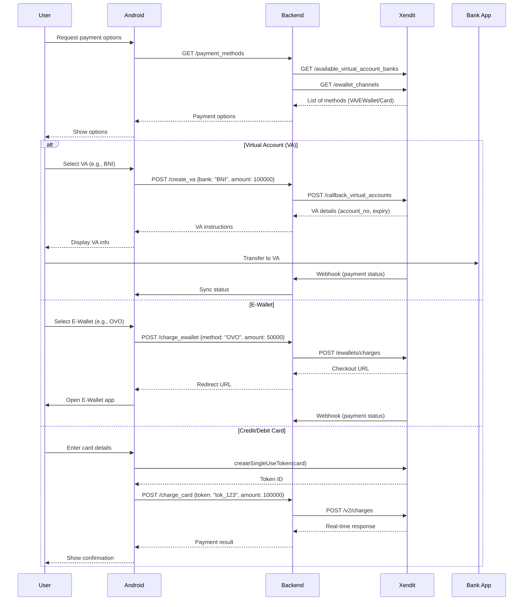

# **Xendit Payment Integration Guide**  

---

## **Payment Flow Diagram**  


---

## **Backend cURL**  
### **1. Authentication**  
- **Secret Key** (Backend-only):  
  ```bash
  # Always keep this server-side!
  export XENDIT_SECRET_KEY="xnd_development_YourSecretKey"
  ```

### **2. API Requests**  
#### **A. Fetch Payment Methods**  
```bash
curl -X GET \
  https://api.xendit.co/available_virtual_account_banks \
  -u "$XENDIT_SECRET_KEY:" \
  -H "Content-Type: application/json"
```

**Response**:  
```json
{
  "banks": [
    {"code": "BNI", "name": "Bank Negara Indonesia"},
    {"code": "BRI", "name": "Bank Rakyat Indonesia"}
  ]
}
```

#### **B. Create Virtual Account**  
```bash
curl -X POST \
  https://api.xendit.co/callback_virtual_accounts \
  -u "$XENDIT_SECRET_KEY:" \
  -H "Content-Type: application/json" \
  -d '{
    "external_id": "va_123",
    "bank_code": "BNI",
    "name": "John Doe",
    "expected_amount": 100000,
    "is_closed": true
  }'
```

**Response**:  
```json
{
  "account_number": "9889901234567890",
  "expiration_date": "2025-12-31T23:59:59Z"
}
```

#### **C. Charge E-Wallet (OVO)**  
```bash
curl -X POST \
  https://api.xendit.co/ewallets/charges \
  -u "$XENDIT_SECRET_KEY:" \
  -H "Content-Type: application/json" \
  -d '{
    "reference_id": "ewallet_123",
    "currency": "IDR",
    "amount": 50000,
    "channel_code": "ID_OVO",
    "channel_properties": {
      "mobile_number": "+6281234567890"
    }
  }'
```

**Response**:  
```json
{
  "checkout_url": "https://checkout.xendit.co/web/123456",
  "status": "PENDING"
}
```

#### **D. Tokenize & Charge Card**  
1. **Tokenize (Frontend SDK)**:  
   *Handled by Android SDK (PCI-compliant).*  

2. **Charge Token (Backend)**:  
```bash
curl -X POST \
  https://api.xendit.co/v2/charges \
  -u "$XENDIT_SECRET_KEY:" \
  -H "Content-Type: application/json" \
  -d '{
    "token_id": "tok_123",
    "external_id": "card_123",
    "amount": 100000,
    "capture": true
  }'
```

**Response**:  
```json
{
  "id": "charge_123",
  "status": "CAPTURED"
}
```

#### **E. AstraPay**
```bash
curl --location 'https://api.xendit.co/ewallets/charges' \
  -u "$XENDIT_SECRET_KEY:" \
  -H "Content-Type: application/json" \
--data '{
    "reference_id": "order-id-1744706751",
    "currency": "IDR",
    "amount": 25000,
    "checkout_method": "ONE_TIME_PAYMENT",
    "channel_code": "ID_ASTRAPAY",
    "channel_properties": {
        "success_redirect_url": "https://redirect.me/payment",
        "failure_redirect_url": "https://redirect.me/failed"
    },
    "metadata": {
        "branch_city": "Senayan"
    }
}'
```

**Response**:  
```json
{
    "id": "ewc_b481afb8-e949-4873-9902-529a7c18c9b7",
    "business_id": "599bd7f1ccab55b020bb1147",
    "reference_id": "order-id-1655711349",
    "status": "PENDING",
    "currency": "IDR",
    "charge_amount": 25000,
    "capture_amount": 25000,
    "refunded_amount": null,
    "checkout_method": "ONE_TIME_PAYMENT",
    "channel_code": "ID_ASTRAPAY",
    "channel_properties": {
        "success_redirect_url": "https://redirect.me/payment",
        "failure_redirect_url": "https://redirect.me/failed"
    },
    "actions": {
        "desktop_web_checkout_url": "https://ewallet-mock-connector.xendit.co/v1/ewallet_connector/checkouts?token=a4eb5b55-1e49-46d1-8459-313d33733c10",
        "mobile_web_checkout_url": "https://ewallet-mock-connector.xendit.co/v1/ewallet_connector/checkouts?token=a4eb5b55-1e49-46d1-8459-313d33733c10",
        "mobile_deeplink_checkout_url": null,
        "qr_checkout_string": null
    },
    "is_redirect_required": true,
    "callback_url": "https://www.google.com",
    "created": "2022-06-20T07:49:11.009452Z",
    "updated": "2022-06-20T07:49:11.009452Z",
    "void_status": null,
    "voided_at": null,
    "capture_now": true,
    "customer_id": null,
    "payment_method_id": null,
    "failure_code": null,
    "basket": null,
    "metadata": {
        "branch_city": "Senayan"
    }
}
```

---

## **Android Integration**  
### **Key Security Practices**  
1. **Never hardcode keys**:  
   ```java
   // Use BuildConfig or secure storage
   Xendit.init(this, BuildConfig.XENDIT_PUBLIC_KEY);
   ```  
2. **Obfuscate code**:  
   ```gradle
   // app/build.gradle
   buildTypes {
       release {
           minifyEnabled true
           proguardFiles getDefaultProguardFile('proguard-android-optimize.txt'), 'proguard-rules.pro'
       }
   }
   ```

### **Error Handling**  
```java
xendit.createSingleUseToken(card, amount, new XenditCallback<Token>() {
    @Override
    public void onSuccess(Token token) {
        // Proceed to charge
    }
    @Override
    public void onError(XenditError error) {
        runOnUiThread(() -> {
            Toast.makeText(this, "Error: " + error.getMessage(), Toast.LENGTH_LONG).show();
        });
    }
});
```

---

## **Webhook Setup**  
### **1. Configure in Xendit Dashboard**  
- URL: `https://yourbackend.com/webhooks/xendit`  
- Events: `virtual_account_paid`, `ewallet_charge_completed`  

### **2. Verify Webhooks (Backend)**  
```python
# Example (Python Flask)
@app.route('/webhooks/xendit', methods=['POST'])
def handle_webhook():
    callback_token = request.headers.get('x-callback-token')
    if callback_token != os.getenv('XENDIT_WEBHOOK_TOKEN'):
        return "Unauthorized", 403
    # Process payload
    return "OK", 200
```

---

## **Testing & Debugging**  
- **Test Cards**:  
  - Success: `4000000000000002`  
  - Failure: `4000000000000119`  
- **Sandbox Mode**:  
  Use `xnd_development_...` keys for testing.  

---

## **References**  
- [Xendit API Docs](https://docs.xendit.co/api-reference/)  
- [Android SDK Guide](https://docs.xendit.co/mobile/xendit-android-sdk)  
