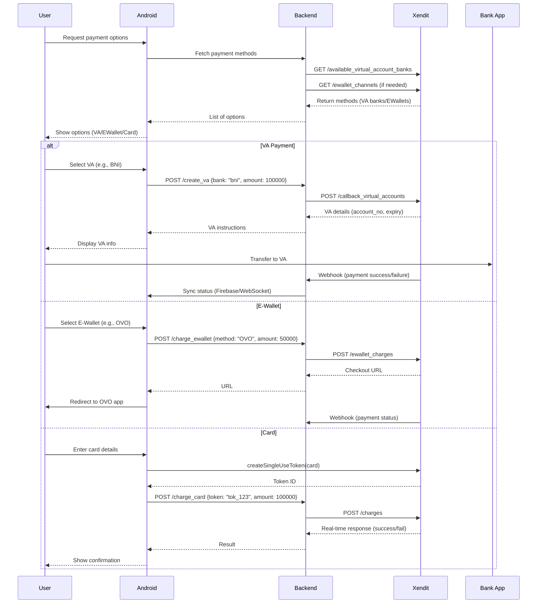

# **Xendit Payment Integration Guide (Android)**  

---

## **1. Payment Flow Overview**  
### **Sequence Diagram**  


---

## **2. Android Implementation**  
### **A. Setup**  
#### **1. Add Xendit SDK**  
```gradle
// app/build.gradle
dependencies {
    implementation 'com.xendit:xendit-android:3.7.0'  // Check for latest version
}
```

#### **2. Initialize SDK**  
```java
// MyApplication.java
public class MyApplication extends Application {
    @Override
    public void onCreate() {
        super.onCreate();
        Xendit.init(this, "xnd_public_development_YOUR_KEY");  // Use public key only!
    }
}
```

#### **3. ProGuard Rules (Security)**  
```proguard
# Add to proguard-rules.pro
-keep class com.xendit.** { *; }
```

---

### **B. Fetch Payment Methods**  
#### **1. Virtual Account Banks**  
```java
Xendit xendit = new Xendit(context, "xnd_public_development_YOUR_KEY");
xendit.getAvailableVABanks(new XenditCallback<List<AvailableBank>>() {
    @Override
    public void onSuccess(List<AvailableBank> banks) {
        // Display to user (e.g., Spinner)
    }
    @Override
    public void onError(XenditError error) {
        showToast("Failed to load banks: " + error.getMessage());
    }
});
```

#### **2. E-Wallets (Hardcoded)**  
```java
// Xendit's supported wallets are fixed. Update as needed.
String[] eWallets = {"OVO", "DANA", "LINKAJA", "SHOPEEPAY"};
```

#### **3. Card Eligibility**  
```java
Card card = new Card("4811111111111114", "12", "2025", "123");
xendit.isCardEligible(card, new XenditCallback<Boolean>() {
    @Override
    public void onSuccess(Boolean isEligible) {
        if (!isEligible) showToast("Card not supported");
    }
    @Override
    public void onError(XenditError error) {
        Log.e("CardError", error.getErrorCode());
    }
});
```

---

### **C. Payment Flows**  
#### **1. Virtual Account (VA)**  
```java
// Step 1: Request VA creation via backend
RetrofitClient.getService().createVA("bni", 100000, "user_123")
    .enqueue(new Callback<VaResponse>() {
        @Override
        public void onResponse(Call<VaResponse> call, Response<VaResponse> response) {
            if (response.isSuccessful()) {
                String vaNumber = response.body().getVaNumber();
                String expiry = response.body().getExpiryDate();
                showVAScreen(vaNumber, expiry);  // Instruct user to transfer
            }
        }
        @Override
        public void onFailure(Call<VaResponse> call, Throwable t) {
            showToast("VA creation failed: " + t.getMessage());
        }
    });

// Step 2: Handle webhook status updates (via Firebase/WebSocket)
```

#### **2. E-Wallet (OVO Example)**  
```java
// Step 1: Initiate charge via backend
RetrofitClient.getService().createEWalletCharge("OVO", 50000)
    .enqueue(new Callback<EwalletResponse>() {
        @Override
        public void onResponse(Call<EwalletResponse> call, Response<EwalletResponse> response) {
            if (response.isSuccessful()) {
                String checkoutUrl = response.body().getCheckoutUrl();
                openEWalletApp(checkoutUrl);  // Redirect user
            }
        }
        @Override
        public void onFailure(Call<EwalletResponse> call, Throwable t) {
            showToast("Failed: " + t.getMessage());
        }
    });

// Step 2: Add deep link to handle returns
<intent-filter>
    <action android:name="android.intent.action.VIEW" />
    <category android:name="android.intent.category.DEFAULT" />
    <data android:scheme="yourapp" android:host="payment" />
</intent-filter>
```

#### **3. Credit/Debit Card**  
```java
// Step 1: Tokenize card (SDK handles PCI compliance)
Card card = new Card("4811111111111114", "12", "2025", "123");
xendit.createSingleUseToken(card, "100000", new XenditCallback<Token>() {
    @Override
    public void onSuccess(Token token) {
        // Step 2: Charge via backend
        RetrofitClient.getService().chargeCard(token.getId(), 100000)
            .enqueue(new Callback<ChargeResponse>() {
                @Override
                public void onResponse(...) { /* Handle success/failure */ }
            });
    }
    @Override
    public void onError(XenditError error) {
        showToast("Tokenization failed: " + error.getMessage());
    }
});
```

---

## **3. Best Practices**  
### **Security**  
- 🔒 **Never** use Xendit’s secret key in Android. Only public keys for SDK initialization.  
- 🔒 Validate all backend responses (e.g., verify payment amounts match orders).  

### **Error Handling**  
- **Retry Logic**: For network errors, allow users to retry payments.  
- **Logging**: Log errors to Crashlytics but sanitize sensitive data (e.g., card numbers).  

### **Testing**  
- Use Xendit’s [test cards](https://docs.xendit.co/testing/) (e.g., `4000000000000002` for success).  
- Test webhook handling with [Ngrok](https://ngrok.com/) for local development.  

---

## **4. References**  
- [Xendit Android SDK Docs](https://docs.xendit.co/mobile/xendit-android-sdk)  
- [Webhook Setup Guide](https://docs.xendit.co/api-reference/#callbacks)  

--- 